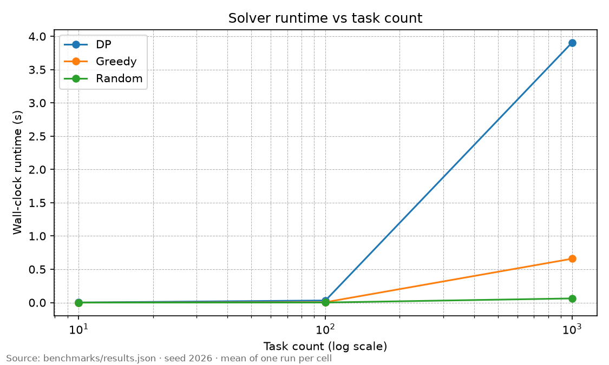
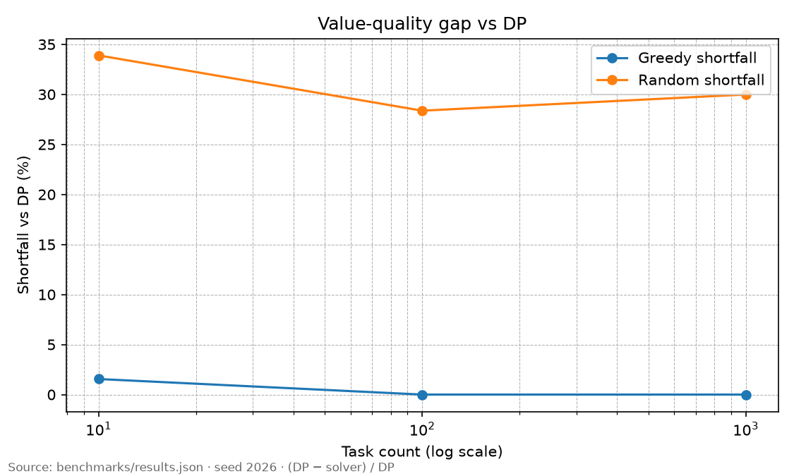

# LLM Token-Budget Allocator

A tool that decides how to allocate a fixed token/dollar budget across a set of competing LLM tasks to maximize total value, comparing an exact dynamic-programming solution against a greedy approximation.

Install and run: `pip install -e .` then `allocator run --budget 20 --tasks tasks.json`.

## Motivation

A service that answers many LLM requests under a **fixed monthly token (or dollar) budget** cannot treat every call the same. Some requests are worth a long, expensive completion; others should be throttled, shortened, or routed to a cheaper model. The allocator takes that constraint literally: given a budget `B` and a list of competing tasks, spend integer tokens to maximize total simulated value.

Task values are **not** live API scores. Each task has a named curve (`log`, `sqrt`, or `constant`) scaled by a weight, so allocating more tokens has shrinking marginal return unless the curve is a 0/1 step. That keeps the project a DS&A artifact instead of a billed OpenAI/Anthropic client.

## Algorithm

Each task `i` has a cap `cap_i` (`token_cost`) and a value function `value_i(t)` for `t = 0..cap_i`. The solver chooses how many tokens each task receives, not only whether to include it.

Let `dp[i][w]` be the maximum value using the first `i` tasks with at most `w` tokens. The recurrence is

```
dp[i][w] = max_{t = 0..min(cap_i, w)}  dp[i-1][w - t] + value_i(t)
```

with `dp[0][·] = 0`. Any feasible assignment of the first `i` tasks spends some `t` on task `i` and the rest on an optimal assignment of the earlier tasks into `w - t`. Those cases partition the search space, so the max is exact. Ties keep the smaller `t` so we do not spend tokens that do not raise value. Time and memory are **O(n · B · cap)**.

When the curve is `constant`, `value_i(t)` is 0 until `t = cap_i` and then the full weight. The same DP then recovers **0/1 knapsack**: take the task at full cost or skip it.

The benchmark opponent is **token-level greedy**, not the 0/1 density fill (`knapsack_greedy`). At each step it spends on the highest-density increment: one token for diminishing `log`/`sqrt` curves, or a jump to the full cap for `constant` tasks (unit steps in between have zero gain). Random assignment of leftover tokens is a third baseline.

## Results

Synthetic sets of 10 / 100 / 1,000 tasks (seed **2026**, mixed curves, budget = one quarter of total cap) are in `benchmarks/results.json`. One run per cell:

| Tasks | DP value | Greedy value | Random value | DP time | Greedy time |
| --- | --- | --- | --- | --- | --- |
| 10 | 29.95 | 29.49 | 19.80 | ~1 ms | ~0.07 ms |
| 100 | 342.35 | 342.35 | 245.24 | ~31 ms | ~6 ms |
| 1,000 | 3678.74 | 3678.74 | 2575.71 | ~3.9 s | ~0.66 s |

Token-level greedy **matches DP at 100 and 1,000 tasks**. Random stays about **30% short** at every scale. DP is the slower exact method (~4 s vs ~0.7 s greedy at n = 1,000), which is the complexity the log-x runtime chart is meant to show:



Greedy does **not** fall apart as `n` grows on these concave-heavy instances. The quality gap vs DP is a small **n = 10** miss (~1.6% of DP value); at 100 and 1,000 the shortfall is zero. Random is the method that stays worse:



Where greedy is actually suboptimal is the **0/1** story, not scale. On the five-task hand instance (budget 10, constant values), DP selects `{review, cite, polish}` for value **13**; 0/1 density greedy takes `{draft, review, cite}` for value **12**, because high value-per-token tasks leave a remainder that a slightly worse-density combo fills better. Dumping a log-budget onto one task is similarly worse than spreading (`log(4)` vs `log(3)+log(2)` for budget 3).

## Limitations

- Tasks are independent: no DAGs, no “must run A before B.”
- There is no latency, SLO, or queueing model — only tokens and simulated value.
- Value curves and weights are assumed **known up front**, not learned online.
- No live LLM API calls, so nothing here measures real model quality.
- No multi-armed bandits or other exploration of uncertain value.
- Not a production service (no deploy, auth, or multi-tenant isolation).
- This is **not** GPU or KV-cache memory allocation; the DP spends a token budget, not device memory.
