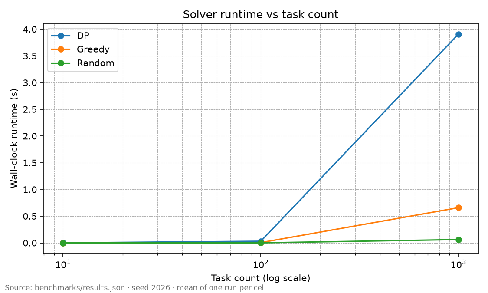
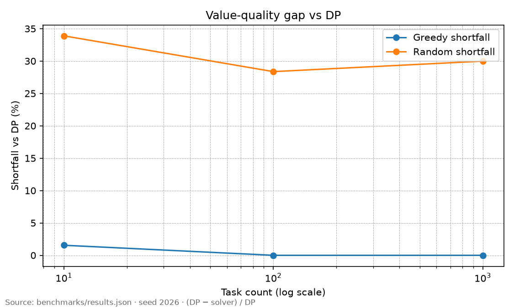

# LLM Token-Budget Allocator

Spend a **fixed token budget** across competing tasks. An exact dynamic program picks how many tokens each task gets; a token-level greedy solver is the baseline.

This is a **DS&A + eval** project, not a hosted Claude app. Public `POST /allocate` uses simulated value curves. Live Anthropic calls happen only if you opt in with `--live` and an API key.

Install: `pip install -e .` (Python 3.11+).

```
allocator run --budget 20 --tasks tasks.json
```

```
uvicorn allocator.api.app:app --host 0.0.0.0 --port 8000
```

Then `POST /allocate` with the same task shape as `tasks.json`. Spec: [`docs/api-requirements.md`](docs/api-requirements.md).

---

## What it does

- Allocates integer tokens under a global budget `B` to maximize total value (`allocate_dp`, `O(n · B · cap)`).
- Compares that assignment to **token-level greedy** and a random leftover fill.
- Serves the same solvers over HTTP (`GET /health`, `POST /allocate`).
- Optionally **collects** Claude completions into a cache, then **replays** solvers offline on 0/1 exact-match scores (no extra API on replay).
- v4: fits a small predictor on a train split, allocates **Haiku 64 vs 256** cost-unit actions on held-out items, scores the assignment on realized cache values.
- v5: given **one prompt**, picks Haiku vs Sonnet from prompt-only features (no gold at route time). Local `POST /route` only if `ALLOCATOR_V5_LOCAL=1`.

---

## What it does not

- **Call Anthropic** from pytest, CI, or public `/allocate`. There is no key on Render.
- **Run the model** when you hit `/route` or `/allocate-predicted`. Those endpoints only choose a policy from cached/fitted numbers. They are off unless you set `ALLOCATOR_V5_LOCAL=1` or `ALLOCATOR_V4_LOCAL=1`.
- Allocate **GPU / KV-cache memory**. The DP spends a token (or cost-unit) budget, not device RAM.
- Model **latency, queues, or SLOs**. Tasks are independent; there is no DAG.
- **Beat** greedy or always-Haiku on the live sets we actually ran. Easy Haiku items already score at 64 tokens; the router tied always-Haiku on live data. Exact-match is a brittle scorer (`H2O` vs a gold string still counts as 0).
- Scrape live **USD prices**. v4/v5 costs are pinned integer ratios (Haiku-64 = 1, Haiku-256 = 4, Sonnet call = 6).
- Replace `max_tokens` with “more thinking.” Extra output length is just a longer completion cap.

---

## Algorithm

Each task `i` has a cap `cap_i` and a value `value_i(t)` for `t = 0..cap_i` (`log`, `sqrt`, or `constant`). The solver chooses **how many** tokens each task receives, not only include/skip.

```
dp[i][w] = max_{t = 0..min(cap_i, w)}  dp[i-1][w - t] + value_i(t)
```

`constant` curves recover 0/1 knapsack. Ties keep the smaller `t`. Greedy spends the highest-density increment at each step (not 0/1 density fill).

On a hand 0/1 instance (budget 10), DP scores **13** and density greedy scores **12**. That is the intended greedy miss, not the large mixed-curve sets.

---

## Synthetic results

Seed **2026**, budget = one quarter of total cap. Numbers: `benchmarks/results.json`.

| Tasks | DP value | Greedy | Random | DP time | Greedy time |
| --- | --- | --- | --- | --- | --- |
| 10 | 29.95 | 29.49 | 19.80 | ~1 ms | ~0.07 ms |
| 100 | 342.35 | 342.35 | 245.24 | ~31 ms | ~6 ms |
| 1,000 | 3678.74 | 3678.74 | 2575.71 | ~3.9 s | ~0.66 s |

Token-level greedy **matches DP at 100 and 1,000**. Random stays ~30% short. The n=10 gap is ~1.6% of DP value.





---

## HTTP API

`POST /allocate` body: `{ "budget": N, "tasks": [...] }`. Caps: n ≤ 100, B ≤ 2000. Returns the DP assignment plus greedy comparison.

```
curl.exe -s -X POST http://127.0.0.1:8000/allocate -H "Content-Type: application/json" -d "{\"budget\":20,\"tasks\":[{\"id\":\"summarize\",\"token_cost\":12,\"weight\":2.5,\"curve\":\"log\"},{\"id\":\"review\",\"token_cost\":8,\"weight\":1.8,\"curve\":\"sqrt\"},{\"id\":\"translate\",\"token_cost\":10,\"weight\":2.0,\"curve\":\"log\"},{\"id\":\"classify\",\"token_cost\":5,\"weight\":4.0,\"curve\":\"constant\"}]}"
```

Demo host: Render free tier (`render.yaml`, Python 3.11). Start: `uvicorn allocator.api.app:app --host 0.0.0.0 --port $PORT`. Load numbers: `benchmarks/api_load_results.json` (p95 at 10 concurrent clients ~25 ms).

---

## Live eval (opt-in)

Collect **once**, replay **offline**. pytest never reads `ANTHROPIC_API_KEY`.

```
python -m allocator.live.collect --live --questions benchmarks/live/questions.json --cache benchmarks/live/cache.json
python -m benchmarks.live_replay --questions benchmarks/live/questions.json --cache benchmarks/live/fixture_cache.json
```

CI uses synthetic fixtures (score only at 256+ tokens). Live caches are separate files (`cache.json`, `cache_v4.json`, `cache_v5.json`, …).

**Haiku live, grade-school n=20:** 17/20 already score at 64 tokens. DP = greedy at B=2560 (17 points, 1088 tokens) and at B=640 (10 vs random 0). Extra `max_tokens` did not fix `q08` / `q15` / `q20` (format vs gold).

**Haiku live, Easy LeetCode n=20:** 19/20 at 64 tokens. DP = greedy again. `lc10` missed because the model wrote `[1, 2, 4]` and last-number match reads `4` vs gold `124`.

**v4 predict-then-allocate** (6/4 split, skip / 64 / 256): on live Haiku, predicted-DP **tied** uniform-64 at 4.0. On a harder show-work cache, predicted-DP **lost** (0 vs uniform-64’s 1.0) by spending the budget on an item that never scores.

**v5 Haiku vs Sonnet** (n=20, 12/8 split): live Haiku 19/20, Sonnet 18/20. Held-out router **tied always-Haiku** (8.0 score, 8 cost, tau=0). Always-Sonnet matched the score at 6× the cost.

Full tables and charts live under `benchmarks/live/` and `benchmarks/charts/`. Requirements: [`docs/live-eval-requirements.md`](docs/live-eval-requirements.md), [`docs/v4-requirements.md`](docs/v4-requirements.md), [`docs/v5-requirements.md`](docs/v5-requirements.md).

Local replay / route (still no Anthropic):

```
python -m benchmarks.v5_replay --cache benchmarks/live/fixture_cache_v5.json
python -m allocator.live.route --question "What is 7 + 5?"
```

---

## Tests

```
python -m pytest
```

---

## License

MIT. See [`LICENSE`](LICENSE).
